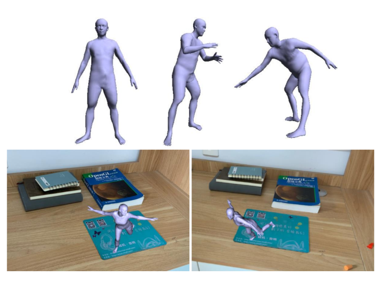
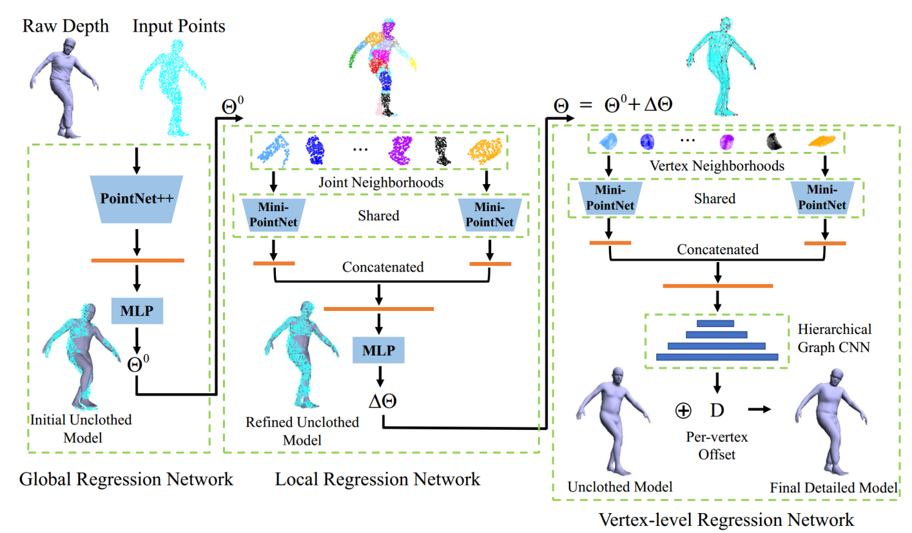

# Parametric Model Estimation for 3D Clothed Humans from Point Clouds
### [paper](http://www.cad.zju.edu.cn/home/gfzhang/papers/ISMAR2021_3DClothedHumans/3DClothedHumans.pdf)


## Network


## Installation

**For Global Regression and Local Rregression, we use CUDA 9.0 and tensorflow 1.8.0, for Vertex-level Regression we use CUDA 10.0 and tensorflow 1.13.1**

Please refer 

[`global_regression/requirements.txt`](global_regression/requirements.txt)

[`local_regression/requirements.txt`](local_regression/requirements.txt)

[`vertex-level_regression/requirements.txt`](vertex-level_regression/requirements.txt)

to prepare the environment.

Then you need compile the code in `*/tf_ops/`. First enter the corresponding folder, i.e. `global_regression/tf_ops/3d_interpolation`

For Global Regression and Local Rregression, run 
```
./tf_interpolate_compile.sh 
```

For Vertex-level Regression, run 
```
make clean && make
```

### Question 
If you have any questions about compiling `/tf_ops/` when running the code, please first look for solutions from [pointnet2](https://github.com/charlesq34/pointnet2).

## Run the code

Please refer the corresponding `README.md`

[Global Regression](global_regression/README.md)

[Local Rregression](local_regression/README.md)

[Vertex-level Regression](vertex-level_regression/README.md)

## Citation

If you find this code useful for your research, please use the following BibTeX entry.

```
@inproceedings{3DClothedHumans,
  title={Parametric Model Estimation for 3D Clothed Humans from Point Clouds},
  author={Wang, Kangkan and Zheng, Huayu and Zhang, Guofeng and Yang, Jian},
  booktitle={ISMAR},
  year={2021}
}
```